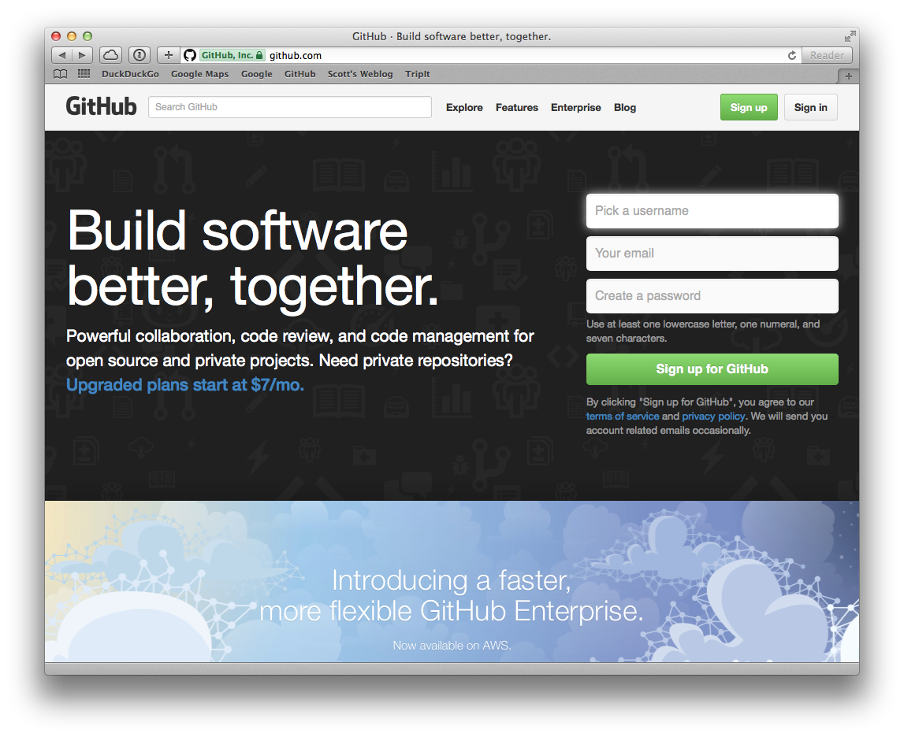
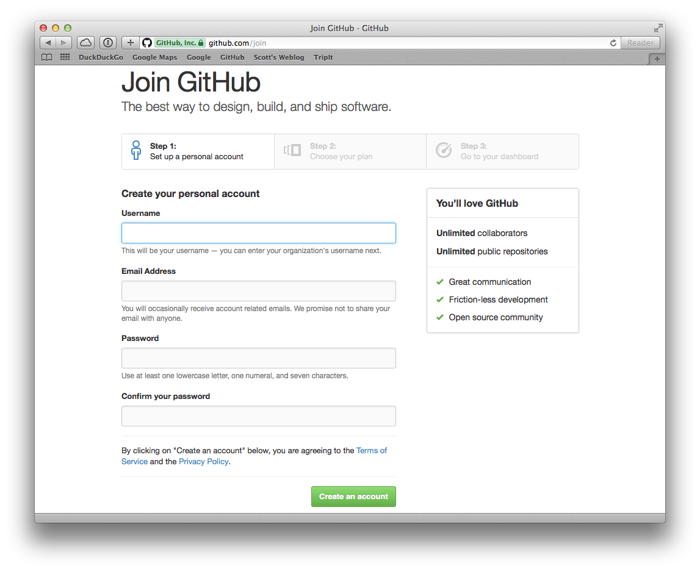

# [fit] **Setting Up OpenStack Learning Environments**

Scott Lowe
[http://blog.scottlowe.org](http://blog.scottlowe.org)

---
# **Quick meetup group status update**

* Fortrust is now our permanent meeting location
* Meetings will be held last Thursday of every month at 6:30pm

---
# **Where we're headed**

* We want to give attendees more hands-on time with OpenStack, not just talk about it
* Working with OpenStack is the best way to become more familiar with it
* To achieve this goal, we're going to walk through building a small OpenStack environment on our laptops

---
# **Feedback**

* Logistically speaking, how is the location and date?
* Does this direction (more hands-on time) make sense?
* Is this what you want from this group?
* What else would you like to see/do?

---
# **Agenda**

* The tools we're going to need
* Installing git
* Setting up a GitHub account
* Installing a virtualization product
* Installing Vagrant

---
# **The tools we're going to need**

* Git (and/or Git GUI tools, if desired)
* A GitHub account
* A desktop virtualization product (Workstation, Fusion, or VirtualBox)
* Vagrant

---
# **Installing Git**

* OS X: Install via installer from [http://git-scm.com](http://git-scm.com) or by installing XCode command-line tools
* Windows: Install via installer from [http://git-scm.com](http://git-scm.com)
* Linux: Install via `apt-get`, `yum`, or package manager of choice
* There are a variety of GUI-based tools that you can also install at your convenience (we'll only use the CLI)

---
# **Setting up a GitHub account**

* We'll use GitHub ([https://github.com](https://github.com)) to share files with you
* No cost to use GitHub (free plan is just fine)
* Works fine with command-line Git (support in GUI tools may vary)
* Not a bad idea to become more familiar with GitHub anyway

---

---

---
# **Installing a virtualization product**

* Fusion (OS X)
* VirtualBox (OS X, Linux, or Windows)
* Workstation (Linux or Windows)
* VirtualBox is free, but Fusion/Workstation will allow use of nested hypervisors (helpful in this use case)
* If using Fusion/Workstation, you'll also need VMware plugin for Vagrant

---
# **Installing Vagrant**

* Latest version is 1.7.2
* Available for OS X, Windows, and Linux
* Download from [http://vagrantup.com](http://vagrantup.com)
* Linux users can also install via `apt-get` or `yum` (although might be older version)

---
# **Some quick Vagrant usage notes**

* Uses a plain text file (a "Vagrantfile") to describe environments
* `vagrant up` starts up the environment in the file
* `vagrant halt` shuts down the environment
* `vagrant destroy` deletes the VMs associated with the environment

---
# [fit] **Questions & Answers**

---

# **Thanks!**

_We (the meetup organizers) are always open to your feedback!_

Blog: [http://blog.scottlowe.org](http://blog.scottlowe.org)
Twitter: [@scott_lowe](https://twitter.com/scott_lowe)
GitHub: [https://github.com/lowescott](https://github.com/lowescott)
Life: Colossians 3:17
