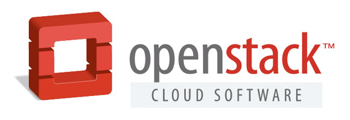

**Enjoy! This month's food provided by...**

---
# **Agenda**

6:30pm - 7:00pm: Introductions and updates
7:00pm - 8:30pm: Developer tools with OpenStack

---
# **Quick updates**

* April meeting will be **re-scheduled** to avoid conflicting with OpenStack Summit in Austin, TX
* Exact date of April meeting will be announced soon
* What interest in resuming building OpenStack on our laptops?
* Any questions/concerns/suggestions?

---

**So you have an OpenStack cloud...now what?**

^ Now you need to get your users to actually use it!
^ To get users to use it, it ideally needs to be as "low friction" as possible

---
# **Developer tools with OpenStack**

* Devs have a number of "low-friction" tools they're already using
* These tools include Vagrant, Docker Machine, and Terraform
* Let's look at how users can use these tools with OpenStack
* All materials from this presentation are available via GitHub ([https://github.com/lowescott/openstack-denver-meetup](https://github.com/lowescott/openstack-denver-meetup))

---
# **Vagrant and OpenStack**

* Vagrant ([http://www.vagrantup.com](http://www.vagrantup.com)) is well-known for manipulating local VMs, but you can also use it with OpenStack
* Allows users to use same `vagrant up` commands they already use
* Consumes capacity on your OpenStack cloud instead of on local laptops, but the user experience is virtually identical
* So what are the difference pieces that are involved?

---
# [fit] **Demo:** Vagrant and OpenStack

^ Already have one Vagrant VM running to save time
^ Show Vagrantfile and YAML data file
^ Show OpenStack Horizon dashboard
^ Run `vagrant plugin list` to show OpenStack provider
^ Run `vagrant up` to spin up the demo VMs
^ Demonstrate connectivity

---
# **Docker Machine and OpenStack**

* Docker Machine ([https://www.docker.com/products/docker-machine](https://www.docker.com/products/docker-machine)) is very similar to Vagrant, but tailored for use with Docker
* VMs/instances created by Docker Machine are automatically provisioned with Docker Engine
* Can leverage a number of different providers, including OpenStack
* How about a demo?

---
# [fit] **Demo:** Docker Machine and OpenStack

^ Already have Swarm master and one node running to save time
^ Show `docker-machine ls` to show machines
^ Run `setup-node2.sh` to create third node
^ Run `eval $(docker-machine env --swarm master)` to configure local Docker client
^ Show pulling Docker images, run `docker info`, etc.

---
# **Terraform and OpenStack**

* Terraform ([https://www.terraform.io/](https://www.terraform.io/)) may be slightly more Ops-oriented than Dev-oriented
* Similar to Heat, but supports multiple providers, platforms, and services
* If using _only_ OpenStack, then Heat is fine
* If using multiple platforms/providers/services, then Terraform may make more sense
* Ready to see a demo?

---
# [fit] **Demo**: Terraform and OpenStack

---
# [fit] **Questions & Answers**

---
# **Thanks!**

_We (the meetup organizers) are always open to your feedback!_

Blog: [http://blog.scottlowe.org](http://blog.scottlowe.org)
Twitter: [@scott_lowe](https://twitter.com/scott_lowe)
GitHub: [https://github.com/lowescott](https://github.com/lowescott)
Life: Colossians 3:17
